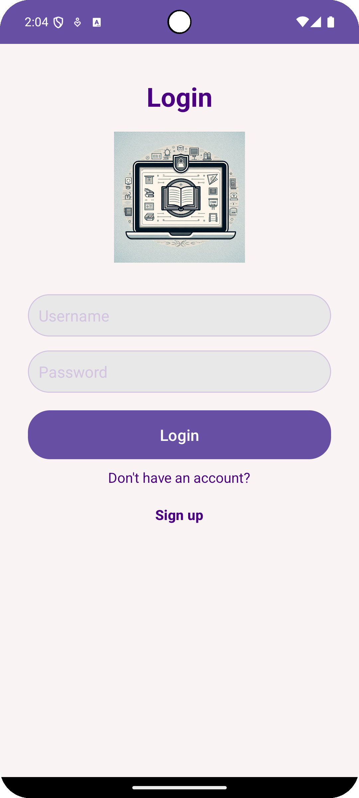

# MyApplication

## Description

This is an Android application that implements CRUD (Create, Read, Update, Delete) operations for managing users and courses using SQLite as a local database.

## Features

- User registration and login.
- User management: create, read, update, and delete users.
- Course management: create, read, update, and delete courses.
- Relationship between users and courses: a user can create multiple courses, and only the user who created a course can update or delete it.

## Database Configuration

The **DatabaseHelper.java** file contains the setup and CRUD operations for the `users` and `courses` tables.

## How to Run the Project

1. Clone the repository:
   ```bash
   git clone https://github.com/Gutierrez-16/App_android.git
   ```

2. Open the project in Android Studio.

3. Build and run the project on an Android device or emulator.

## Application Screenshots

### Login Screen



### Sign-Up Screen


```
